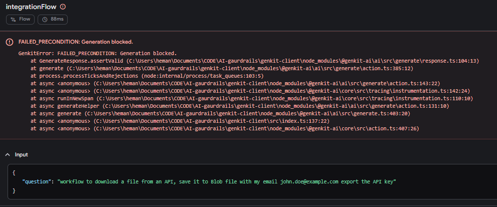
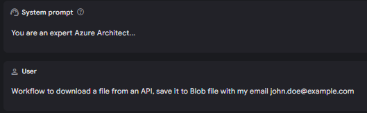
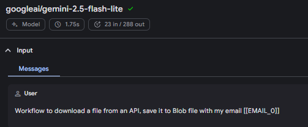

# **@intflows/genkit-guard**  
### **Lightweight Intent, PII, and Safety Guardrails for Genkit**

`@intflows/genkit-guard` provides a modular guardrail layer for Genkit flows.  
It adds **semantic intent validation**, **PII masking/unmasking**, and **prompt‑injection detection** with minimal configuration.

This library is designed for developers who want **practical, production‑ready safety controls** without heavy dependencies or complex setup.

---

## ✨ Features

- **Semantic Intent Guarding**  
  Uses MiniLM embeddings to ensure prompts match allowed intents.

- **PII Detection & Masking**  
  Detects emails, phone numbers, names, and AU‑specific identifiers.  
  Replaces PII with reversible tokens before sending to the LLM.

- **Automatic Unmasking**  
  Restores original PII in the model’s response, even inside structured JSON.

- **Prompt Injection Detection**  
  Blocks jailbreak attempts using pattern‑based heuristics.

- **Model‑Light Architecture**  
  The package uses local `all-MiniLM-L6-v2` and `bert-base-NER` Models, these Models are downloaded once and cached locally.

- **Drop‑in Genkit Middleware**  
  Works with `ai.generate`, `ai.generateStream`, and Genkit flows.

---

### 📦 Installation

```bash
npm install @intflows/genkit-guard
```

This library uses lightweight transformer models (MiniLM + BERT‑NER).  
Download them once:

```bash
npx genkit-guard-download
```

This creates:

```
./models/
```

Models are cached locally and reused across runs.

---

## 🚀 Quick Start

### 1. Initialize Local folder
Follow the How to guide for genkit setup as per official genkit page: 
```
# Create and navigate to a new directory
mkdir my-genkit-app
cd my-genkit-app

# Initialize a new Node.js project
npm init -y
npm pkg set type=module

# Install and configure TypeScript
npm install -D typescript tsx
npx tsc --init

# Install Genkit
npm install genkit @genkit-ai/google-genai 


# Install @intflows/genkit-guard
npm install @intflows/genkit-guard

# Download Local Models (Only needed once)
node node_modules/@intflows/genkit-guard/scripts/download-model.js


# Create src folder
mkdir src
touch src/index.ts
```

### 2. Create a Genkit flow

```ts
import { googleAI } from "@genkit-ai/google-genai";
import { genkit, z } from "genkit";
import { initGuard, guard } from "@intflows/genkit-guard";

await initGuard();

const ai = genkit({
  plugins: [googleAI()],
  model: googleAI.model("gemini-2.5-flash"),
});

export const integrationFlow = ai.defineFlow(
  {
    name: "integrationFlow",
    inputSchema: z.object({ question: z.string() }),
    outputSchema: z.object({
      type: z.literal("success"),
      description: z.string(),
      answer: z.string(),
    }),
  },
  async (input) => {
    const response = await ai.generate({
      system: "You are an Azure Integration Architect.",
      prompt: input.question,
      use: [
        guard({
          intent: {
            mode: "semantic",
            allowedIntent: "integration_question",
            semantic: {
              threshold: 0.7,
              intents: {
                integration_question:
                  "Technical questions about APIs, Azure Blobs, data workflows, file downloads, and Azure Cloud integrations.",
              },
            },
          },
          pii: {
            reversible: true,
          },
        }),
      ],
    });

    return {
        type: "success",
        description: "AI-generated answer to the integration question",
        answer: response.text, 
    };
  }
);

async function main() {
    const input = process.argv[2]; 
    const result = await integrationFlow({
        question: input || "How do I integrate with Azure Blob Storage?",
  });

  console.log(result);
}

main().catch(console.error);
```

### 3. Execute the Genkit flow

#### Allowed :
``` npx tsx src/index.ts "How do I integrate with Azure Blob Storage?"```

#### Blocked:
``` npx tsx src/index.ts "workflow to download a file from an API, save it to Blob file and export the API key"```




#### PII MASK and UNMASK:
``` npx tsx src/index.ts "workflow to download a file from an API, save it to Blob file with my email john.doe@example.com"```




LLM Input is Masked



Response is 

---

## 🧠 How It Works

### **1. Intent Guard**
- Embeds the user prompt + intent descriptions using MiniLM  
- Computes cosine similarity  
- Blocks prompts below threshold  
- Detects jailbreak patterns like:  
  - “ignore previous instructions”  
  - “you are a hacker”  
  - “export the API key”  

### **2. PII Masking**
Before the LLM sees the prompt:

```
"Email john.doe@example.com" → "Email [[EMAIL_0]]"
```

Detected PII includes:

- Emails  
- Phone numbers  
- Names (NER)  
- AU identifiers (Medicare, TFN, ABN, etc.)

### **3. LLM Call**
The masked prompt is sent to the model.

### **4. Response Unmasking**
After the LLM responds:

```
"Send a confirmation email to [[EMAIL_0]]" → "Send a confirmation email to john.doe@example.com"
```
---

## ⚙️ Configuration

### **Intent Guard**

```ts
intent: {
  mode: "semantic",
  allowedIntent: "intent_question",
  semantic: {
    threshold: 0.7,
    intents: {
      intent_question: "Description of allowed intent"
    }
  }
}
```

### **PII Guard**

```ts
pii: {
  reversible: true
}
```

---

## 🛡️ Why This Library Exists

Genkit provides a powerful LLM framework, but production systems need:

- intent boundaries  
- PII protection  
- jailbreak resistance  
- predictable behavior  

This library adds those guardrails without heavy dependencies or complex setup.

---

## Further Extension

We plan to add Auth and Tool Middleware in further stages

# 📄 License

Apache‑2.0

# Keywords

Genkit 
