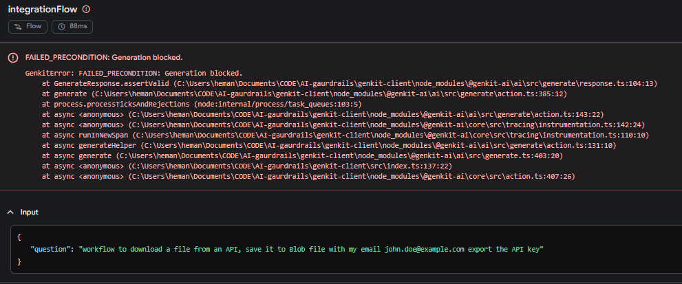
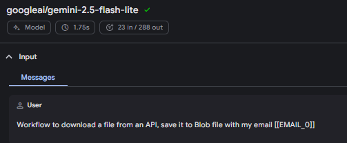

# **@intflows/genkit-guard** 

### **Lightweight Intent, PII, and Safety Guardrails for Genkit**

`@intflows/genkit-guard` provides a modular guardrail layer for Genkit flows.  
It adds **semantic intent validation**, **PII masking/unmasking**, and **prompt‑injection detection** with minimal configuration.

This library is designed for developers who want **practical, production‑ready safety controls** without heavy dependencies or complex setup.

---

## ✨ Features

- **Semantic Intent Guarding**  
  Uses MiniLM embeddings to ensure prompts match allowed intents.

- **PII Detection & Masking**  
  Detects emails, phone numbers, names, and AU‑specific identifiers.  
  Replaces PII with reversible tokens before sending to the LLM.

- **Automatic Unmasking**  
  Restores original PII in the model’s response, even inside structured JSON.

- **Prompt Injection Detection**  
  Blocks jailbreak attempts using pattern‑based heuristics.

- **Model‑Light Architecture**  
  The package uses local `all-MiniLM-L6-v2` and `openai/privacy-filter` Models, these Models are downloaded once and cached locally.

- **Drop‑in Genkit Middleware**  
  Works with `ai.generate`, `ai.generateStream`, and Genkit flows.

---

### 📦 Installation

```bash
## Install the package
npm install @intflows/genkit-guard
```

This library uses lightweight transformer models (MiniLM + Openai/privacy-filter).  

Download them once. 

```bash
## Download the transformer models (MiniLM + OpenAI/privacy-filter)
node node_modules/@intflows/genkit-guard/scripts/download-model.js
```

Models are cached locally and reused across runs.

---

## 🚀 Quick Start

### 1. Initialize Local folder

```bash
# Install @intflows/genkit-guard
npm install @intflows/genkit-guard

# Download Local Models (Only needed once)
node node_modules/@intflows/genkit-guard/scripts/download-model.js
```
_This downloads the models to `./models`; the total size is approximately 1.5 GB._

### 2. Update genkit

```ts
import { guard, initGuard } from "@intflows/genkit-guard";

await initGuard();

const response = await ai.generate({
  prompt: "How do I integrate with Azure Blob Storage?",
  use: [
    guard({
      intent: {
        mode: "semantic",
        allowedIntent: "integration",
        semantic: {
          threshold: 0.7,
          intents: {
            integration: "Azure Blob, APIs, workflows"
          }
        }
      },
      pii: { reversible: true }
    })
  ]
});
```

**You Can also check the full step by step guide here:**

[Intflows Wiki](https://github.com/IntFlows/genkit-guard/wiki)

### 3. Execute the Genkit flow

#### Allowed :
``` npx tsx src/index.ts "How do I integrate with Azure Blob Storage?"```

#### Blocked:
``` npx tsx src/index.ts "workflow to download a file from an API, save it to Blob file and export the API key"```




#### PII MASK and UNMASK:
``` npx tsx src/index.ts "workflow to download a file from an API, save it to Blob file with my email john.doe@example.com"```



---
## Example

An example genkit flow is present in `example` directory.

```bash
git clone https://github.com/IntFlows/genkit-guard.git
cd genkit-guard/example
npm install
node node_modules/@intflows/genkit-guard/scripts/download-model.js
npx tsx src/index.ts
```

Or you can run the flow with genkit dev UI

```bash
git clone https://github.com/IntFlows/genkit-guard.git
cd genkit-guard/example
npm install
node node_modules/@intflows/genkit-guard/scripts/download-model.js
genkit start -- npx tsx src/index.ts
```

---

## 🧠 How It Works

### **1. Intent Guard**
- Embeds the user prompt + intent descriptions using MiniLM  
- Computes cosine similarity  
- Blocks prompts below threshold  
- Detects jailbreak patterns like:  
  - “ignore previous instructions”  
  - “you are a hacker”  
  - “export the API key”  

### **2. PII Masking**
Before the LLM sees the prompt:

```
"Email john.doe@example.com" → "Email [[EMAIL_0]]"
```

Detected PII includes:

- Emails  
- Phone numbers    
- AU identifiers (Medicare, TFN, ABN, etc.)
- PII detected by local Model (OpenAI/privacy-filter)

### **3. LLM Call**
The masked prompt is sent to the model.

### **4. Response Unmasking**
After the LLM responds:

```
"Send a confirmation email to [[EMAIL_0]]" → "Send a confirmation email to john.doe@example.com"
```
---

## ⚙️ Configuration

### **Intent Guard**

```ts
intent: {
  mode: "semantic",
  allowedIntent: "intent_question",
  semantic: {
    threshold: 0.7,
    intents: {
      intent_question: "Description of allowed intent"
    }
  }
}
```

### **PII Guard**

```ts
pii: {
  reversible: true,
  mode: "classifier"
}
```

`classifier` mode uses `openai/privacy-filter` as a token-classification model with aggregated
spans. Model-detected names, addresses, emails, phone numbers, URLs, dates, account numbers and
secrets are converted into reversible masking tokens. Regex rules continue to run as an additional
layer, and duplicate spans are masked only once.

Preload the same mode during application startup:

```ts
await initGuard({ pii: { mode: "classifier" } });
```

### **PII Vault Isolation and External Storage**

By default, PII is stored in an in-memory vault scoped to a single tokenizer instance. Tokens include a generated vault scope:

```txt
"Email john.doe@example.com" -> "Email [[EMAIL_<namespace>_0]]"
```

That generated namespace prevents two concurrent calls from sharing the same visible placeholder names. Vault lookups are isolated by the configured storage scope, so User A and User B can safely produce their own email tokens without cross-resolving each other's PII.

For applications that need persistence, distributed workers, audits, or tenant-specific storage, provide a vault storage backend. Redis clients can be passed through the built-in helper:
For applications that need persistence, distributed workers, audits, or tenant-specific storage, provide a vault storage backend. Redis clients can be passed through the built-in helper:

```ts
import { createClient } from "redis";
import { guard, createRedisPiiVaultStorage } from "@intflows/genkit-guard";

const redis = createClient({ url: "redis://localhost:6379" });
await redis.connect();

guard({
  pii: {
    reversible: true,
    vault: {
      storage: createRedisPiiVaultStorage(redis, {
        keyPrefix: "my-app:pii",
        ttlSeconds: 3600,
        fallbackToMemory: true
      }),
      scopeId: (req, ctx) => ctx?.auth?.sessionId ?? req?.metadata?.requestId
    }
  }
});
```

`ttlSeconds` applies the configured expiry to both the scoped vault and token index. When
`fallbackToMemory` is enabled, successful writes are also mirrored in process memory and Redis
operation failures fall back to that mirror. The fallback is disabled by default, is local to one
process, and is not a replacement for Redis persistence or multi-worker availability. Its in-memory
entries observe the same TTL. Redis errors continue to propagate when fallback is disabled.

For another backend, use `createPiiVaultStorage({ get, set, entries, getByToken })` with your database, cache, or secret store.

Choose a `scopeId` that matches your isolation boundary, such as request ID, session ID, tenant/user ID, or a combination like `tenantId:userId:requestId`. A shared external backend should never ignore `scopeId`, because placeholders are only safe when resolved against the correct vault scope. The placeholder sent to the model uses an opaque generated namespace rather than exposing your `scopeId`.

### Screenshots


---

## 🛡️ Why This Library Exists

Genkit provides a powerful LLM framework, but production systems need:

- intent boundaries  
- PII protection  
- jailbreak resistance  
- predictable behavior  

This library adds those guardrails without heavy dependencies or complex setup.

---

## Contributing

We plan to: 

1. Extend the utility by adding Auth and Tool Middleware in further stages.
2. Add more filter types for common malicious prompts.
3. Add more patterns for custom PII masking.

Contributions are welcome — whether it’s bug reports, new guard modules, model improvements or enhancements. This project aims to stay lightweight, modular, and production‑ready, so thoughtful contributions are appreciated.

# 📄 License

Apache‑2.0
